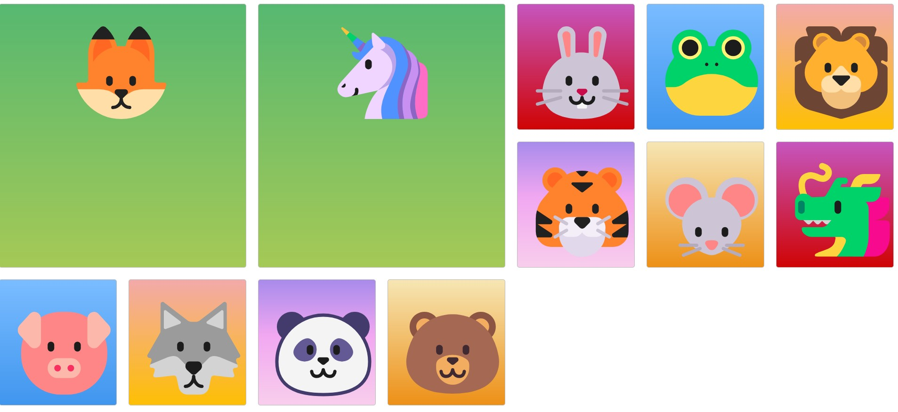

# CSS-Grid-Master
"CSS Grid Master" is a fun, responsive web application showcasing a dynamic grid layout. This project uses HTML and CSS Grid for responsive design and creates visually appealing, interactive zones with various gradient backgrounds and emojis. Perfect for learning CSS Grid and responsive layouts!

## Demo

## Features
Responsive Design: Uses CSS Grid with auto-fill for flexible column width, ensuring a seamless layout on various screen sizes.
Gradient Backgrounds: Each grid item has a unique gradient color that enhances visual aesthetics.
Hover Effects: Grid items have a shadow effect on hover, providing an interactive feel.
Emojis: Fun animal emojis represent each grid item, adding personality to the design.

## Technologies Used
HTML5: Structuring the webpage
CSS3: Styling with CSS Grid for layout and gradients for backgrounds

## Usage
Clone the Repository
bash
Copy code
git clone https://github.com/Abdulrahman843/CSS-Grid-Master.git
cd CSS-Grid-Master
Open index.html
Run this project by simply opening the index.html file in your browser.

## Files
index.html – Contains the structure of the grid layout.
style.css – Contains the styling rules, including CSS Grid properties and gradient backgrounds.

## Code Overview
HTML Structure
The grid items are wrapped in a .container div and given classes to apply different background colors.

CSS Grid Styling
The grid is designed to be responsive, adjusting to screen size using grid-template-columns and grid-auto-rows.

## Contributing
Feel free to fork this project and create your own unique designs using CSS Grid and gradient effects.

