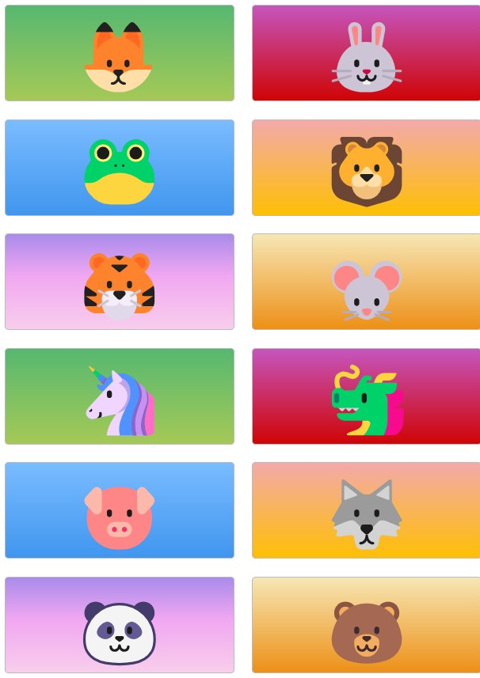

# CSS-Grid-Master
CSS-Grid-Master is a simple web-based project that demonstrates the use of CSS Grid layout for responsive design and showcases various gradient color styles and interactive hover effects. This layout is ideal for beginners to understand CSS grid properties and responsive design concepts.

## Table of Contents
Project Overview
Features
Technologies Used
Screenshots
Setup
Usage
Contributing
License

### Project Overview
This project consists of a grid container with multiple colored zones, each displaying a unique animal emoji. The design utilizes CSS Grid for layout structure, responsive adjustments for various screen sizes, and CSS gradients for styling. Hover effects are applied to each zone, enhancing user interaction.

### Features
Responsive grid layout that adjusts to screen sizes
Interactive hover effect on each grid item
Gradient background colors for visual appeal
Flexibility with auto-fit columns to accommodate different screen widths

### Technologies Used
HTML: Markup language for creating the structure of the webpage.
CSS: Styling language for design, layout, and interactive effects.

### Screenshots
Screenshot 1: Desktop view showcasing the complete grid layout.
Screenshot 2: Mobile view demonstrating responsive adjustments.

### Setup
Clone this repository using git clone https://github.com/Abdulrahman843/CSS-Grid-Master.git
cd grid-master
Open index.html in your browser to view the project.

### Usage
Feel free to customize the grid layout or styling to explore CSS Grid properties and gradient effects.

### Contributing
Contributions are welcome! Feel free to submit pull requests or suggest improvements.

### License
This project is licensed under the MIT License.

